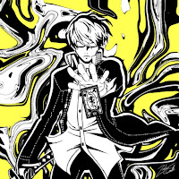

<p align="center">
  
</p>

<h3 align="center">A daily guessing game set in the Persona universe — from Persona 1 to Persona 5X.</h3>

<p align="center">
  <a href="https://personadle.net"></a>
  <a href="https://github.com/CodeByHaamza/personadle/releases"></a>
  <a href="https://github.com/CodeByHaamza/personadle/actions/workflows/ci.yml"></a>
  
  <a href="LICENSE.txt"></a>
</p>

<p align="center">
  
  
  
  
  <a href="https://discord.gg/wpMdGGDp3y"></a>
</p>

<p align="center">
  <a href="#-play">Play</a> ·
  <a href="#-six-modes-twelve-ways-to-play">Modes</a> ·
  <a href="#-features">Features</a> ·
  <a href="#-whats-new">What's new</a> ·
  <a href="#-under-the-hood">Under the hood</a> ·
  <a href="#-run-it-locally">Run it locally</a> ·
  <a href="#-community">Community</a> ·
  <a href="#-credits">Credits</a>
</p>

<p align="center">
  
</p>

---

## 🎮 Play

Every day at midnight (Paris time), each mode draws a new target. Guess it with the clues you're given,
compare with your friends, keep your streak alive.

1. Open **[personadle.net](https://personadle.net)** — no install, no account required.
2. Pick a mode. Type a name; the autocomplete shows portraits.
3. Every guess reveals something. Find the answer, or **give up** to see it.
4. **Replay** as many times as you like — every game counts toward your stats.
5. Create a free account to sync across devices, add friends, climb the leaderboard and unlock badges.

> 🇫🇷 🇪🇸 🇩🇪 🇮🇹 🇵🇹 The whole game is available in six languages, auto-detected from your browser.

---

## 🎯 Six modes, twelve ways to play

<table>
  <tr>
    <td align="center" width="33%"><br><b>🔍 Classic</b><br><sub>Compare traits — Arcana, gender, age, game, Persona — with colour-coded feedback.</sub></td>
    <td align="center" width="33%"><br><b>😀 Emoji</b><br><sub>Four emojis describe a character. One new emoji every wrong guess.</sub></td>
    <td align="center" width="33%"><br><b>⚔️ All-Out Attack</b><br><sub>Recognise the finisher animation, from a blurred frame to the full sequence.</sub></td>
  </tr>
  <tr>
    <td align="center"><br><b>🖤 Silhouette</b><br><sub>A black shape that sharpens with each attempt. Right-click can't cheat it.</sub></td>
    <td align="center"><br><b>👤 Personae</b><br><sub>Here's the Persona — who wields it? From Orpheus to the Kanzato brothers.</sub></td>
    <td align="center"><br><b>🎵 Music</b><br><sub>A few seconds of a track. 80+ songs, P1 → P5X, Q and Q2 included.</sub></td>
  </tr>
</table>

**⚡ Expert Mode** — every mode has a harder twin, earned by playing: a single quote instead of traits,
one *lying* emoji, a flash you trigger yourself, a frozen black-and-white blur, lyrics without audio,
the Persona's real myth with its name masked. Expert keeps its own targets, stats and leaderboard.

---

## ✨ Features

<table>
  <tr>
    <td width="33%">🎖️ <b>69 badges</b><br><sub>Some secret, one you earn <i>together</i> with a friend, all verified server-side.</sub></td>
    <td width="33%">🏅 <b>Titles & Compendium</b><br><sub>Equip a title; every deed is written, dated, in your Compendium.</sub></td>
    <td width="33%">🖼️ <b>Profile card</b><br><sub>A shareable PNG of your profile — 8 themes, 39 wallpapers, copy straight to Discord.</sub></td>
  </tr>
  <tr>
    <td>👥 <b>Friends & Social Links</b><br><sub>Friend codes, P4 TV / calling-card animations, ranks 1 → 10 per Arcana.</sub></td>
    <td>⚔️ <b>Challenges</b><br><sub>Send your daily game to a friend — normal or Expert — and compare.</sub></td>
    <td>🏆 <b>Leaderboard</b><br><sub>By mode, period and dimension (Normal / Expert), friends-only scope.</sub></td>
  </tr>
  <tr>
    <td>☁️ <b>Cloud sync</b><br><sub>Offline-first; the server is the source of truth once you log in.</sub></td>
    <td>🎨 <b>Persona 5 UI</b><br><sub>Dark mode, colour-blind palette, profile music, atelier for everything you customise.</sub></td>
    <td>🛡️ <b>Admin & anti-cheat</b><br><sub>Moderation panel, event codes, daily target recomputed on the server.</sub></td>
  </tr>
</table>

<details>
<summary><b>More screenshots</b> — profile, leaderboard, friends</summary>
<br>
<table>
  <tr>
    <td></td>
    <td></td>
  </tr>
  <tr>
    <td></td>
    <td></td>
  </tr>
</table>
</details>

---

## 🆕 What's new

**2.2 — September 2026** · *Profile showcase & Compendium*

- **Profile showcase**: badges in large, wallpaper collection, share card; everything editable lives in one **Atelier**.
- **Compendium** of titles, **Expert leaderboard** dimension, opus filters in a window.
- **Wonder Shujin** in All-Out Attack, five new badges, the *Go Beyond* title, seven titles, three songs.
- Persona Q / Q2 portraits, Persona 4 Revival wallpaper, Portuguese titles.
- 2.2.x: Expert stats editable, badge *Same Energy* fixed, weekly Discord top 3, "Copy for Discord" repaired.

📦 **[All releases with notes →](https://github.com/CodeByHaamza/personadle/releases)** ·
📖 Player changelogs: [2.2](./PersonaDLE_Update_Documentation/PersonaDLE%202.2/PersonaDLE_Update.html) · [2.1](./PersonaDLE_Update_Documentation/PersonaDLE%202.1/PersonaDLE_Update.html) ·
🔧 Dev changelogs: [2.2](./PersonaDLE_Update_Documentation/PersonaDLE%202.2/DEV_CHANGELOG.md) · [2.1](./PersonaDLE_Update_Documentation/PersonaDLE%202.1/DEV_CHANGELOG.md) · [2.0](./PersonaDLE_Update_Documentation/PersonaDLE%202.0/DEV_CHANGELOG.md)

---

## 🛠️ Under the hood

No framework, no bundler, no build step. The front end is plain ES modules; the back end is PHP with
prepared statements only; the database is the source of truth.

```
Browser ── ES modules ──► /api (PHP 8.2, PDO) ──► MariaDB 10.6+ → 31-table relational schema
   │                          │
   │  localStorage            │  sessions httpOnly · bcrypt · CSRF · rate limiting
   │  (offline-first)         │  CSP · HSTS · exact-origin CORS · Psalm taint analysis
   ▼                          ▼
Service worker              Cron: leaderboard cache, Discord daily & weekly posts, GDPR purge
```

| Layer | What |
|---|---|
| **Front end** | HTML5 · CSS3 (one file per component, dark mode) · Vanilla JavaScript ES6+ |
| **Back end** | PHP 8.2 REST API — `GET/POST/PATCH/DELETE /api/{resource}`, JSON, proper status codes |
| **Database** | MariaDB 10.6+ / MySQL 8.0 — 31-table relational schema, 1448+ unit tests keep the contract honest |
| **i18n** | EN · FR · ES · DE · IT · PT (1297 keys each), `en.json` is the source of truth |
| **Hosting** | Hostinger, auto-deploy on push to `main`; SQL migrations applied by hand *before* the merge |

### Quality gates

Every pull request runs the whole thing; `main` only receives releases from `develop`.

```
Vitest + jsdom → 1448 tests unitaires (logique de jeu, backend, streak, i18n, validation données)
PHPUnit        → tests de logique pure + intégration DB (contrat de schéma)
Playwright     → 258 E2E sur la stack Docker complète (smoke, API, Social Link)
PHPStan        → analyse statique PHP niveau 5 · Psalm → taint analysis
ESLint+Prettier→ lint + format · i18n / data / daily-pool consistency checks
```

Supported browsers: Chrome 90+, Firefox 88+, Safari 14+ (iOS 14+), Edge 90+.

---

## 🧑‍💻 Run it locally

```bash
git clone https://github.com/CodeByHaamza/personadle.git && cd personadle
npm install

make up          # MariaDB + PHP + phpMyAdmin in Docker, schema and seed loaded → http://localhost:8080
npm test         # 1448 unit tests
make test-php    # PHPUnit, inside the container
npm run test:e2e # Playwright against the Docker stack
make check       # lint + data + i18n + doc numbers + daily pools
```

Where to read next: **[CONTRIBUTING.md](CONTRIBUTING.md)** (branches, conventions, review checklist) ·
**[DEPLOY.md](DEPLOY.md)** (release procedure, migrations) · **[ROADMAP.md](ROADMAP.md)** (what's next) ·
**[tests/README.md](tests/README.md)** and **[tests-e2e/README.md](tests-e2e/README.md)** (the test pyramid).

---

## 💬 Community

- **Discord — PersonaDLE** · [discord.gg/wpMdGGDp3y](https://discord.gg/wpMdGGDp3y): daily puzzle announcements, weekly top 3, the Velvet Room Arcana test, profile gallery, bug reports and ideas (one thread each — every thread gets a status).
- **Discord — Le Grimoire du Cœur** · [discord.gg/CfR8UHXTAE](https://discord.gg/CfR8UHXTAE): our French partner server, the most active.
- **Bugs & ideas** · [GitHub issues](https://github.com/CodeByHaamza/personadle/issues) work too.

---

## 👥 Credits

### Core team

<table>
  <tr>
    <td align="center">
      <br>
      <b>Hamza Karrouchi</b><br>
      <sub>Founder & lead developer — game design, logic, backend, UI, content, ops. Sole maintainer since mid-2025.</sub>
    </td>
  </tr>
</table>

### Contributors

PersonaDLE started as a small team in spring 2025. These people shaped its early days.

<table>
  <tr>
    <td align="center" width="33%">
      <br>
      <b>Léo (L2GENDAIRE)</b><br><sub>Data & design, 2025 — original character database, layout, portraits</sub>
    </td>
    <td align="center" width="33%">
      <br>
      <b>Damien (Corbover)</b><br><sub>Front end, 2026 — CSS modularisation, responsive groundwork</sub>
    </td>
    <td align="center" width="33%">
      <br>
      <b>Dzulian</b><br><sub>Consultant — Persona 1 & 2 ideas and data accuracy</sub>
    </td>
  </tr>
</table>

### Thanks

- **[Smashdle](https://smashdle.net/)** (Pimeko) for the concept, **[Pokedle](https://github.com/maxm33/pokedle)** for the early codebase reference.
-  **Arati** ([YouTube](https://www.youtube.com/@Arati_Persona) · [X](https://x.com/Arati)) for featuring PersonaDLE, and  **[Faz](https://www.youtube.com/@FazPersona)** for the All-Out Attack footage.
- The **[Megami Tensei Wiki](https://megamitensei.fandom.com/)** for character data, r/persona4golden and both Discord servers for testing and endless feedback.
- **Atlus / SEGA** for the universe, **Shoji Meguro** for the music.

---

## ⚖️ License & disclaimer

The **source code** is released under the [MIT License](LICENSE.txt). The **game assets** — character
names, portraits, artwork, music, logos, quotes and any other Persona / Shin Megami Tensei content —
are **not** covered by it: they remain the property of their rights holders (© ATLUS · © SEGA) and may
not be redistributed. Reuse the code, bring your own assets.

PersonaDLE is a **fan-made, non-commercial project**, not affiliated with, endorsed by or connected to
Atlus or SEGA. Rights holders may request the removal of their material at any time; such requests are
honoured.

<sub>Some badges and wallpapers were made with AI assistance. As students working on this project for
free, we didn't have the budget to commission artists; we deeply respect them and would prioritise
working with human artists if PersonaDLE ever received support.</sub>

---

<p align="center">
  <strong>"I am thou, thou art I… And together, we'll reach the truth."</strong><br>
  <sub>Made with ❤️ by fans, for fans. If you enjoy PersonaDLE, support the official games.</sub>
</p>
